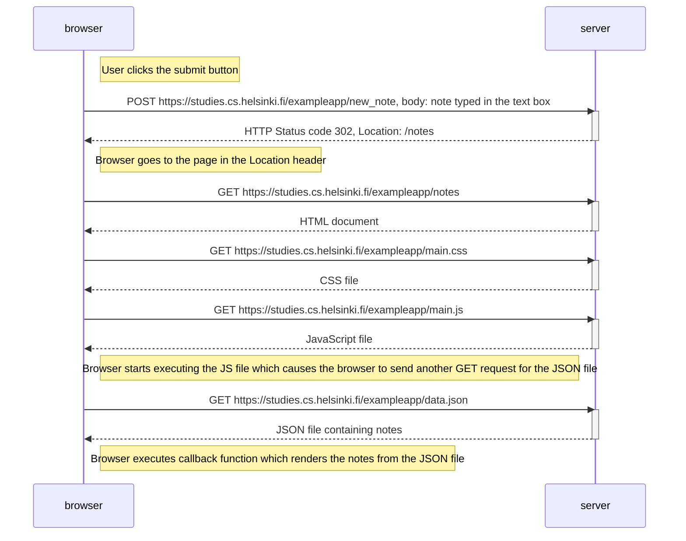

```mermaid
sequenceDiagram
  participant browser
  participant server
  
  Note right of browser: User clicks the submit button
  browser->>server: POST https://studies.cs.helsinki.fi/exampleapp/new_note, body: note typed in the text box
  activate server
  server-->>browser: HTTP Status code 302, Location: /notes
  deactivate server
  
  Note right of browser: Browser goes to the page in the Location header
  browser->>server: GET https://studies.cs.helsinki.fi/exampleapp/notes
  activate server
  server-->>browser: HTML document
  deactivate server
  
  browser->>server: GET https://studies.cs.helsinki.fi/exampleapp/main.css
  activate server
  server-->>browser: CSS file
  deactivate server
  
  browser->>server: GET https://studies.cs.helsinki.fi/exampleapp/main.js
  activate server
  server-->>browser: JavaScript file
  deactivate server
  
  Note right of browser: Browser starts executing the JS file which causes the browser to send another GET request for the JSON file
  browser->>server: GET https://studies.cs.helsinki.fi/exampleapp/data.json
  activate server
  server-->>browser: JSON file containing notes
  deactivate server
  
  Note right of browser: Browser executes callback function which renders the notes from the JSON file
```
