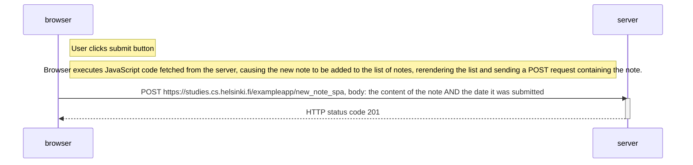

```mermaid
sequenceDiagram
  participant browser
  participant server
  Note right of browser: User clicks submit button
  Note right of browser: Browser executes JavaScript code fetched from the server, causing the new note to be added to the list of notes, rerendering the list and sending a POST request containing the note.
  
  browser->>server: POST https://studies.cs.helsinki.fi/exampleapp/new_note_spa, body: the content of the note AND the date it was submitted
  activate server
  server-->>browser: HTTP status code 201
  deactivate server
```
